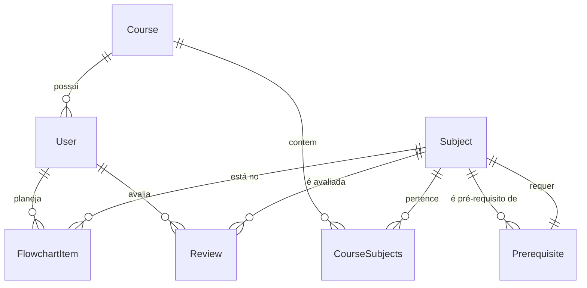

# MentorGraduação

Software para planejar o fluxo da sua graduação. Com base no fluxo ideal do curso e nos pré-requisitos, o sistema sugere as disciplinas mais vantajosas de cursar a cada semestre, além de fornecer informações de ementa, bibliografia e avaliações de disciplinas.

Projeto acadêmico da disciplina de Engenharia de Software (UFRN).

## Componentes

- Maria Helena Fernandes Leocádio
- Rodrigo de Menezes Souza
- Thaís Karolyne Militão De Lima
- Williane Ferreira Cardoso

## Stack

- **Backend:** FastAPI + SQLAlchemy + Alembic + JWT + MySQL (Docker)
- **Frontend:** React 18 + TypeScript + Vite + React Router 6

## Funcionalidades implementadas

### Sprint 1 — Autenticação e Cadastro de Curso
- Registro e login de usuários (JWT)
- Cadastro e listagem de cursos
- Rota protegida `/auth/me` para dados do usuário logado

### Sprint 2 — Estrutura Curricular
- Cadastro e listagem de disciplinas vinculadas a um curso
- Detalhe da disciplina (ementa, bibliografia, resumo)
- Pesquisa por nome ou código
- Definição de pré-requisitos entre disciplinas

### Sprint 3 — Fluxograma Pessoal
- Grade visual de semestres com disciplinas planejadas
- Adicionar/remover disciplinas do fluxograma
- Validação de pré-requisitos (impede adicionar sem cumprir)
- Marcar disciplina como cursada
- Sugestão automática de disciplinas disponíveis com base nos pré-requisitos cumpridos
- Mover disciplinas entre semestres

### Sprint 4 — Avaliações
- Avaliar disciplina cursada (nota 0–10 + resenha + upload de comprovante)
- Restrição: apenas uma avaliação por disciplina por usuário
- Restrição: só avalia quem completou a disciplina
- Lista pública de avaliações por disciplina

## Estrutura do projeto

```
MentorGraduacao/
├── .github/workflows
│   ├── ci-pipeline.yaml            # Integração contínua
├── backend/
│   ├── app/
│   │   ├── main.py                 # FastAPI app entrypoint
│   │   ├── config.py               # Configurações (DB, JWT)
│   │   ├── database.py             # SQLAlchemy engine + session
│   │   ├── models/                 # Modelos: Course, User, Subject, CourseSubjects, Prerequisite, FlowchartItem, Review
│   │   ├── schemas/                # Schemas Pydantic
│   │   ├── routers/                # Endpoints: auth, courses, subjects, flowchart, reviews
│   │   └── services/               # Lógica de autenticação (bcrypt, JWT)
│   ├── alembic/                    # Migrations
│   ├── tests/                      # Diretório dos testes
│   ├── Dockerfile                  # Arquivo de Configuração de Build
│   ├── .env.example                # exemplo do env para configurar o DATABASE_URL
│   └── requirements.txt
├── database/
│   ├── cria_schema_mentor_graduacao.sql # Schema do banco de dados
│   ├── dados.sql                        # Dados iniciais
│   └── README.md                        # Setup do banco
├── frontend/
│   ├── src/
│   │   ├── components/             # Header, ProtectedRoute
│   │   ├── pages/                  # Home, Login, Courses, Subjects, SubjectDetail, SubjectCreate, Flowchart
│   │   ├── services/               # API client + serviços (auth, course, subject, flowchart, review)
│   │   ├── App.tsx
│   │   ├── index.css
│   │   └── main.tsx                 
│   ├── index.html                  # HTML base
│   ├── package.json  
│   ├── vite.config.ts              # Proxy /api → backend
│   └── Dockerfile                  # Arquivo de Configuração de Build
├── READ.md                         # Especificações do projeto, incluindo como rodar
├── userStories.md                  # Requisitos funcionais
├── docker-compose.yml              # Gerencia dos container
└── .gitignore
```

## Como rodar

### Projeto completo via Docker

```bash
docker compose up --build
```

### Banco de dados (MySQL via Docker)

```bash
cd database
docker compose up -d
```

### Backend

Copie e edite as credenciais do banco:

```bash
cd backend
cp .env.example .env
```

#### Linux

```bash
cd backend
python3 -m venv .venv
source .venv/bin/activate
pip install -r requirements.txt
alembic upgrade head
python seeds/seed.py
uvicorn app.main:app --reload
```

#### Windows

```bash
cd backend
python3 -m venv .venv
.\.venv\Scripts\Activate.ps1
pip install -r requirements.txt
alembic upgrade head
python seeds/seed.py
uvicorn app.main:app --reload
```

Se é a primeira vez rodando o código, talvez seja necessário rodar o seguinte comando antes de rodar _alembic upgrade head_
```bash
alembic stamp head
```

Servidor em `http://localhost:8000`. Docs interativas em `http://localhost:8000/docs`.

**Testes** usam SQLite in-memory (independem do Docker):

```bash
cd backend
python -m pytest
```

### Frontend

```bash
cd frontend
npm install
npm run dev
```

Servidor em `http://localhost:5173`. Rotas `/api/*` são proxyadas para o backend.

### Dados de exemplo

O script `backend/seeds/seed.py` cria:
- Curso: Ciência da Computação (UFRN) e Engenharia de Computação (UFRN)
- Admin: admin@test.com / 123456 (Com autorizações especiais)
- 17 disciplinas com 12 pré-requisitos

O `database/dados.sql` também pode ser usado como init do Docker MySQL.

## Schema do banco

### Entidades



### Tabelas

**Course** — Cursos cadastrados no sistema.

| Coluna | Tipo | Descrição |
|---|---|---|
| id | INT (PK) | Identificador único |
| nome | VARCHAR(255) | Nome do curso |
| instituicao | VARCHAR(255) | Instituição de ensino |

**User** — Usuários da plataforma.

| Coluna | Tipo | Descrição |
|---|---|---|
| id | INT (PK) | Identificador único |
| nome | VARCHAR(255) | Nome do usuário |
| email | VARCHAR(255) (UNIQUE) | Email de login |
| senha_hash | VARCHAR(255) | Hash bcrypt da senha |
| curso_id | INT (FK → Course) | Curso do usuário (NOT NULL) |

**Subject** — Disciplinas da grade curricular.

| Coluna | Tipo | Descrição |
|---|---|---|
| id | INT (PK) | Identificador único |
| nome | VARCHAR(255) | Nome da disciplina |
| codigo | VARCHAR(50) | Código (ex: IMD0001) |
| ementa | TEXT | Ementa da disciplina |
| bibliografia | TEXT | Bibliografia recomendada |
| resumo | TEXT | Resumo dos tópicos |
| periodo_recomendado | INT | Período sugerido (1 a N) |

**CourseSubjects** — Associação entre curso e disciplina.

| Coluna | Tipo | Descrição |
|---|---|---|
| id | INT (PK) | Identificador único |
| course_id | INT (FK → Course) | Curso |
| subject_id | INT (FK → Subject) | Disciplina |
| | UNIQUE(course_id, subject_id) | Garante que não haja duplicatas |

**Prerequisite** — Pré-requisitos entre disciplinas.

| Coluna | Tipo | Descrição |
|---|---|---|
| id | INT (PK) | Identificador único |
| subject_id | INT (FK → Subject) | Disciplina que depende |
| prerequisite_subject_id | INT (FK → Subject) | Disciplina pré-requisito |
| | UNIQUE(subject_id, prerequisite_subject_id) | Garante pares únicos |

**FlowchartItem** — Disciplina no fluxograma pessoal do usuário.

| Coluna | Tipo | Descrição |
|---|---|---|
| id | INT (PK) | Identificador único |
| user_id | INT (FK → User) | Usuário dono do fluxograma |
| subject_id | INT (FK → Subject) | Disciplina adicionada |
| semester_index | INT | Semestre no fluxograma (1, 2, 3...) |
| status | ENUM('planned', 'completed') | Planejada ou cursada |
| | UNIQUE(user_id, subject_id) | Uma entrada por disciplina por usuário |

**Review** — Avaliação de disciplina cursada.

| Coluna | Tipo | Descrição |
|---|---|---|
| id | INT (PK) | Identificador único |
| user_id | INT (FK → User) | Autor da avaliação |
| subject_id | INT (FK → Subject) | Disciplina avaliada |
| nota | DECIMAL(3,1) | Nota de 0.0 a 10.0 |
| resenha | TEXT | Resenha/texto da avaliação |
| comprovante_url | VARCHAR(500) | URL do comprovante de conclusão |
| created_at | TIMESTAMP | Data da avaliação |

## Rotas da API

| Método | Rota | Auth | Descrição |
|---|---|---|---|
| POST | `/auth/register` | — | Registrar usuário |
| POST | `/auth/login` | — | Login (retorna JWT) |
| GET | `/auth/me` | Bearer | Dados do usuário logado |
| GET | `/courses/` | — | Listar cursos |
| POST | `/courses/` | — | Criar curso |
| GET | `/subjects/` | — | Listar disciplinas (filtro: ?search=, ?course_id=) |
| GET | `/subjects/{id}` | — | Detalhe da disciplina |
| GET | `/subjects/{id}/prerequisites` | — | Pré-requisitos da disciplina |
| POST | `/subjects/` | — | Criar disciplina |
| GET | `/flowchart/` | Bearer | Listar fluxograma do usuário |
| POST | `/flowchart/` | Bearer | Adicionar disciplina ao fluxograma |
| PUT | `/flowchart/{id}` | Bearer | Alterar semestre/status |
| DELETE | `/flowchart/{id}` | Bearer | Remover do fluxograma |
| GET | `/flowchart/suggestions` | Bearer | Sugestões de disciplinas |
| GET | `/subjects/{id}/reviews` | — | Listar avaliações |
| POST | `/subjects/{id}/reviews` | Bearer | Avaliar disciplina |
| GET | `/health` | — | Health check |

> **Nota:** As grades curriculares dos cursos cadastrados no banco podem não refletir a versão mais recente da matriz curricular oficial da UFRN. Consulte o SIGAA para a grade atualizada de cada curso.

## Licença

MIT