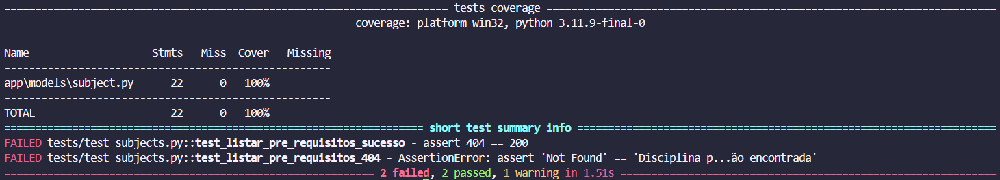

# Relatório de Testes - Sprint 2

## 1. Classe Testada
A classe escolhida para o teste de unidade foi a **`app.models.subject.Subject`** (Modelo de Banco de Dados de Disciplinas).

## 2. O que foi testado
Foram criados testes utilizando o `pytest` para validar:
- O retorno correto ao listar disciplinas vazias e cadastradas.
- O funcionamento dos filtros de busca por `course_id`, `nome` e `código` da disciplina.
- A criação e listagem bem-sucedida de relacionamentos (pré-requisitos) entre disciplinas.
- O tratamento de erros (HTTP 404) ao buscar pré-requisitos de uma disciplina inexistente.

## 3. Resultado da Cobertura (Coverage)
A execução dos testes obteve sucesso em todas as asserções. Como demonstrado no print abaixo, a cobertura para o módulo `app\models\subject.py` superou a meta mínima de 60% exigida para a Sprint.

